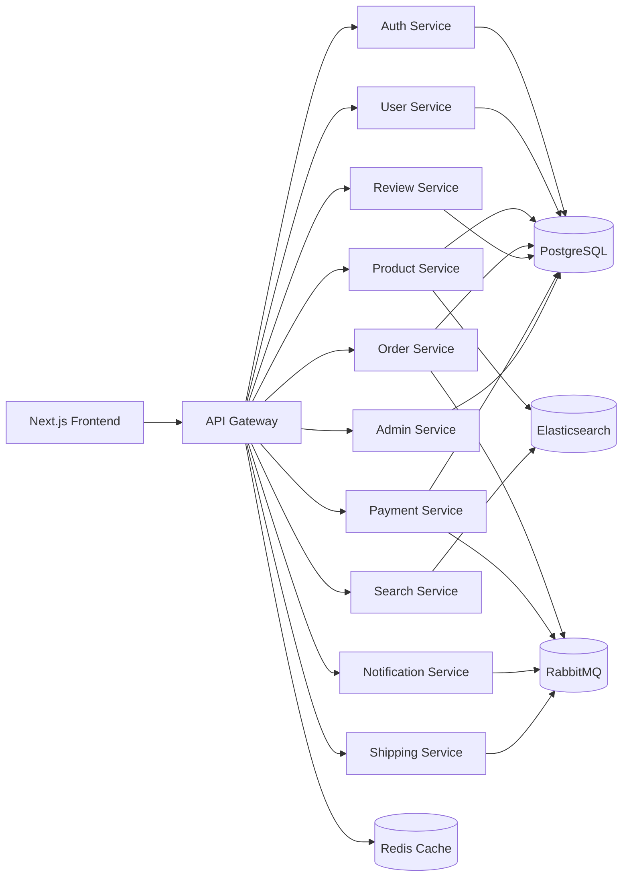

# Zentro Marketplace Monorepo

Plataforma marketplace global estilo Mercado Libre/Amazon basada en microservicios, arquitectura orientada a eventos y despliegue cloud-native.

## Stack principal
- **Frontend:** Next.js 14, React, TypeScript, TailwindCSS.
- **Backend:** NestJS + Node.js en microservicios.
- **Datos:** PostgreSQL, Redis, Elasticsearch.
- **Mensajería:** RabbitMQ.
- **Infra:** Docker, Docker Compose, Kubernetes-ready.

## Arquitectura



## Estructura

- `apps/frontend`: Aplicación web Next.js 14.
- `apps/api-gateway`: API Gateway NestJS.
- `apps/services/*`: 10 microservicios de dominio.
- `infra/docker`: archivos de contenedores y orquestación local.
- `infra/k8s`: manifests base para Kubernetes.
- `docs`: documentación funcional y técnica.
- `scripts`: utilidades de bootstrap.

## Inicio rápido

1. Copiar variables:
   ```bash
   cp .env.example .env
   ```
2. Levantar stack:
   ```bash
   docker compose -f infra/docker/docker-compose.yml up --build
   ```
3. Frontend: http://localhost:3000
4. API Gateway: http://localhost:8080

## Estado del proyecto

Este repositorio incluye una base productiva inicial:
- contratos API,
- microservicios esqueleto con patrones Controller/Service/Repository/DTO/Validation,
- eventos de dominio en RabbitMQ,
- frontend con UX marketplace responsive,
- documentación de despliegue, seguridad, performance y roadmap.
